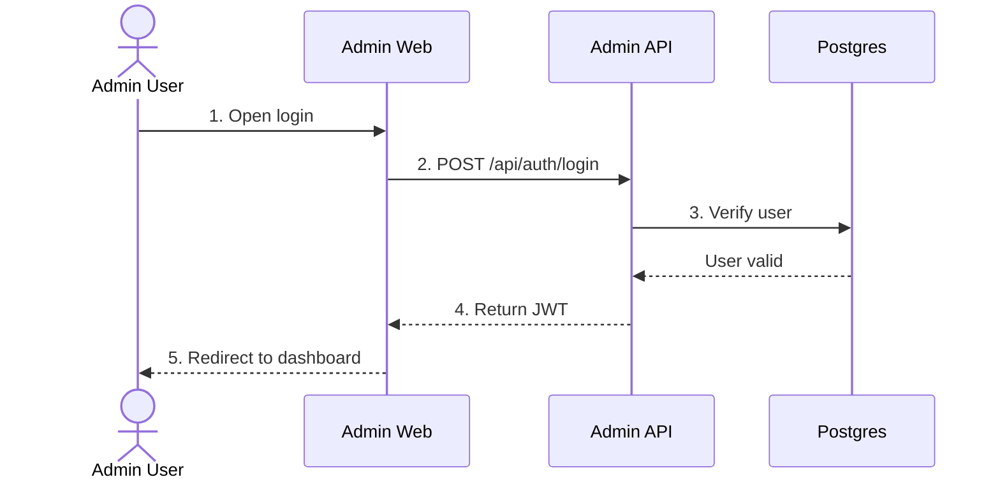

# FLOW-login

## Intent

Admin user logs into the back-office.

## Flow

1. Op opens login `W-AD-AUTH-001` on Admin Web
2. Web `POST` login `API-AD-AUTH-001` on Admin API
3. API validates credentials against Postgres
4. API returns JWT
5. Web stores JWT and redirects to dashboard

## Diagram

