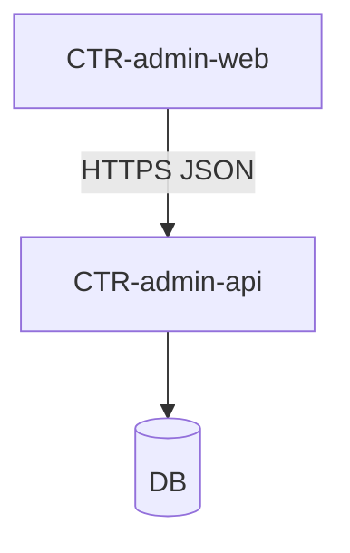

# 05 — Building blocks

status: active

C4 **containers** + index of **components**. MD + Mermaid only.  
**SSOT for CMP + Code remains under `product/`** — do not duplicate `code/` here.

This chapter describes runtime technology boundaries. Admin, Workforce, Shop-floor, and Plant Integration remain operational-area classifications in [§03 Context](/architecture/03-context/).

## CTR-admin-web

Admin SPA / Nuxt (or Next) client. Runs Playwright E2E; reads specs from docs hub Code tier.

## CTR-admin-api

Admin HTTP API. Owns auth session/token validation for admin actors.

`CTR-admin-api` identifies the deployed API service. Individual endpoint contracts such as `API-AD-AUTH-001` remain Function detail under their owning `CMP-*`.

| Container | Role | Code refs |
|-----------|------|-----------|
| `CTR-admin-web` | FE | `W-AD-*` |
| `CTR-admin-api` | BE | `API-AD-*` |

## Components (index)

| ID | Name | Path |
|----|------|------|
| [CMP-01](/product/components/CMP-01-auth/) | Auth | `product/components/CMP-01-auth/` |

## See also

- [06 Runtime](/architecture/06-runtime/)
- Redirect: [`/architecture/containers/`](/architecture/containers/)
