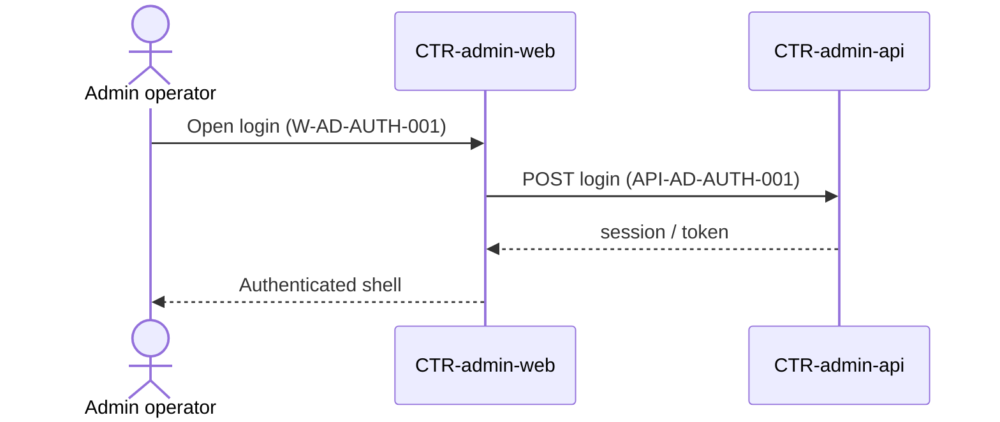

# FLOW-login — Operator login

domain: admin

Operator login via Admin Web against Admin API.

Alias (deprecated): `DYN-login`

## Steps

1. Op opens login `W-AD-AUTH-001` on `CTR-admin-web`
2. Web `POST` login `API-AD-AUTH-001` on `CTR-admin-api`
3. API returns session/token; web shows authenticated shell

## Diagram

## Related

- [CMP-01 Auth](/product/components/CMP-01-auth/)
- [06 Runtime catalog](/architecture/06-runtime/)
