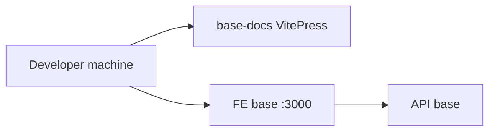

# 07 — Deployment

status: stub

**Optional.** Write `DEP-*` only when runtime **placement** matters.  
Do not invent prod topology. Local machine tips stay out of this repo.

## DEP-local

Local WSL / Docker compose style layout for platform bases.  
Prod/staging: TBD.

## Notes

- Redirect: [`/architecture/deployments/`](/architecture/deployments/)
