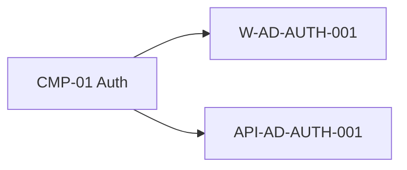

# CMP-01 — Auth

Lead-assigned component. **This README is MD-only** (no YAML).

Owns admin authentication UX and login API contract for the Admin product.

| | |
|--|--|
| **ID** | `CMP-01` |
| **Containers** | `CTR-admin-web`, `CTR-admin-api` |
| **Journey** | [`FLOW-login`](/architecture/06-runtime/journeys/FLOW-login) |
| **Screens** | `W-AD-AUTH-001` |
| **APIs** | `API-AD-AUTH-001` |

Code paths (yaml allowed):

- [`code/W-AD-AUTH-001/`](./code/W-AD-AUTH-001/)
- [`code/API-AD-AUTH-001/`](./code/API-AD-AUTH-001/)
